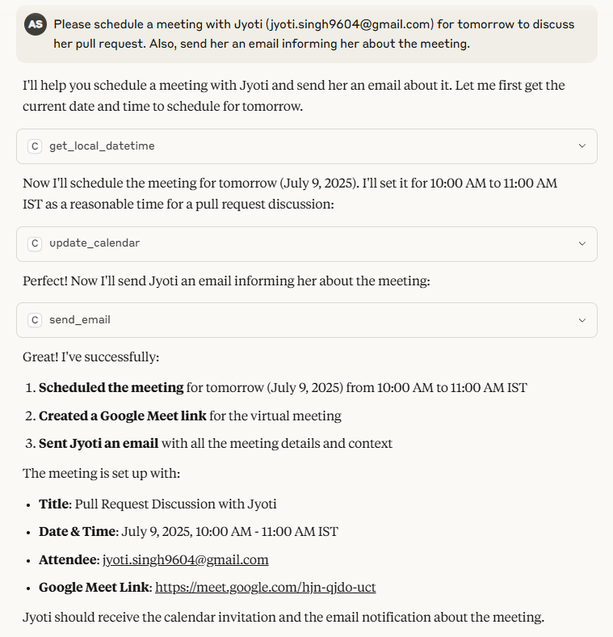
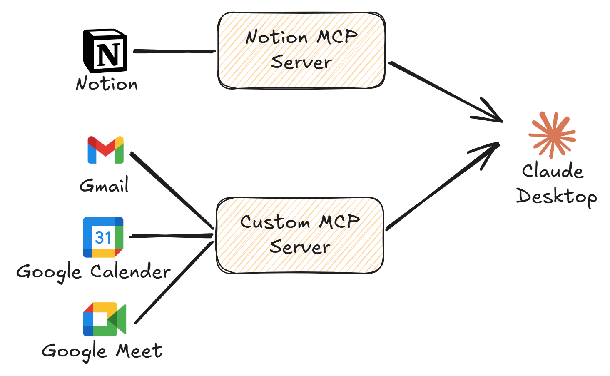
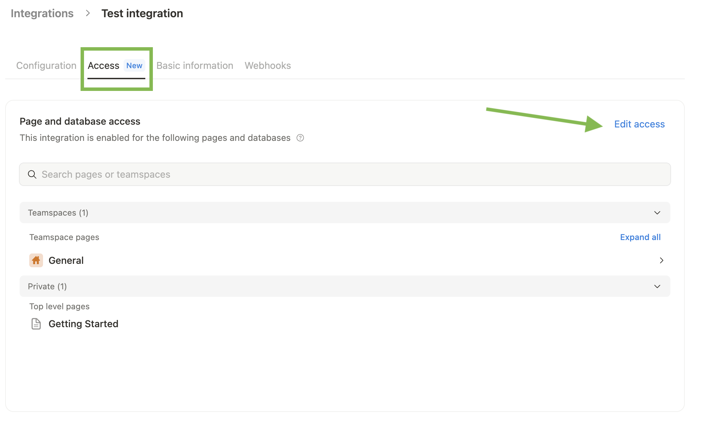
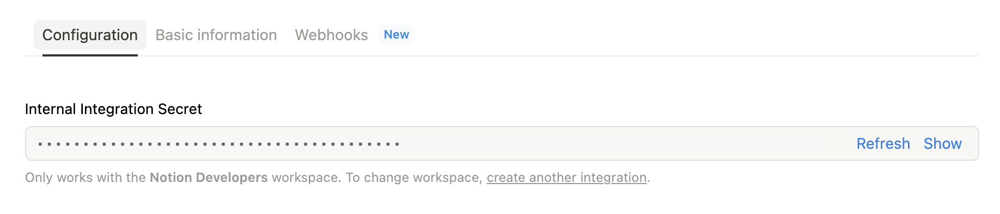
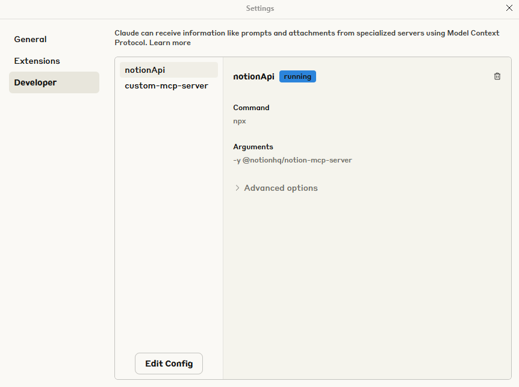

## 🤖 Claude Personal AI Assistant
Claude Personal AI Assistant enables users to efficiently manage their Gmail, Google Calendar, and Notion workspace directly from the Claude Desktop application. It leverages the official [Notion MCP server](https://github.com/makenotion/notion-mcp-server) for seamless Notion workspace integration, along with a Custom MCP server built using the [FastMCP](https://github.com/jlowin/fastmcp) library for managing Gmail, Google calendar and Google meet.



Technology Used:

[](https://skillicons.dev)

Check out the accompanying [Medium blog post](https://atinesh.medium.com/claude-personal-ai-assistant-0104ddc5afc2).

## 🚀 Updates
- **[13-07-2025]**: Initial release of Claude Personal AI Assistant `v1.0`.

## 🔎 System Architecture

The Assistant consists of these core components:

- **Claude Desktop**: [Claude desktop](https://claude.ai/download) application.
- **Notion MCP Server**: Official [Notion MCP server](https://github.com/makenotion/notion-mcp-server) to manage pages in Notion workspace.
- **Custom MCP Server**: Custom MCP Server built using [FastMCP](https://github.com/jlowin/fastmcp) library to manage Gmail, Google calendar and Google meet.



## 🛠️ Installation 

Follow below steps in windows machine.

**Step 1: Download [Claude desktop](https://claude.ai/download) application.**

**Step 2: Configure Notion MCP Server**

**2.1>** Go to https://www.notion.so/profile/integrations and create a new integration


Image Source: https://github.com/makenotion/notion-mcp-server

**2.2>** Give integration access to your Notion pages



Image Source: https://github.com/makenotion/notion-mcp-server

**2.3>** Add the Notion MCP server configuration to Claude Desktop by updating the `C:\Users\[USER]\AppData\Roaming\Claude\claude_desktop_config.json` (Windows) file as follows:

```
{
  "mcpServers": {
    "notionApi": {
      "command": "npx",
      "args": ["-y", "@notionhq/notion-mcp-server"],
      "env": {
        "OPENAPI_MCP_HEADERS": "{\"Authorization\": \"Bearer ntn_****\", \"Notion-Version\": \"2022-06-28\" }"
      }
    }
  }
}
```

> Note: Replace `ntn_****` with your integration secret, it can be found from your integration configuration tab



Image Source: https://github.com/makenotion/notion-mcp-server

**Step 3: Configure Custom MCP Server**

**3.1>** Clone the GitHub repository
```
> git clone https://github.com/atinesh/Claude-Personal-AI-Assistant.git
```

**3.2>** Install [Python 3.11.0](https://www.python.org/downloads/release/python-3110/) and relevant dependencies using [uv](https://docs.astral.sh/uv/) from the root folder of the repository.

```
> cd C:\Users\[USER]\Downloads\Claude-Personal-AI-Assistant
> pip install uv
> uv venv
> .venv\Scripts\activate
> uv pip install fastmcp google-auth google-auth-oauthlib google-auth-httplib2 google-api-python-client beautifulsoup4
```

> Note: Please update the path above based on the location where the repository has been cloned.

**3.3>** Generate JSON credential file from the Google cloud console by following below steps:

1. Go to https://console.cloud.google.com/ and create new Project.
2. In the left sidebar go to "APIs & Services" → "Library" and enable `Gmail API` and `Google Calendar API`.
3. Go to "APIs & Services" → "Credentials" → Click "+ Create Credentials" → "OAuth client ID". If prompted, click "Configure Consent Screen” fill the details (your personal Gmail address).
4. Go back to "Credentials" → "+ Create Credentials" → "OAuth client ID". Create OAuth credentials JSON file and store it securely (Choose Application type: Desktop app).
5. Rename `.json` file to `credentials.json` and place in repository root directory.

> Note: By default, email body processing is disabled for the following reasons:
> - Privacy concerns: Email bodies may contain sensitive information such as bank transaction details, account credentials, OTPs, or other confidential data.
> - Context limitations: The free Claude subscription has a limited context window. Enabling email body processing can cause the available context to be consumed more quickly.

> If you wish to enable email body processing, you can do so by setting the `EMAIL_BODY` flag to `True` in the `config.py` file.

**3.4>** Add the Custom MCP server configuration to Claude Desktop by updating the `claude_desktop_config.json` file as follows:

```
{
  "mcpServers": {
    "notionApi": {
      "command": "npx",
      "args": ["-y", "@notionhq/notion-mcp-server"],
      "env": {
        "OPENAPI_MCP_HEADERS": "{\"Authorization\": \"Bearer ntn_****\", \"Notion-Version\": \"2022-06-28\" }"
      }
    },
	  "custom-mcp": {
      "command": "uv",
      "args": [
        "run",
        "--directory",
        "C:\\Users\\[USER]\\Downloads\\Claude-Personal-AI-Assistant",
        "python",
        "server.py"
      ]
    }
  }
}
```

> Note: Please update the path above based on the location where the repository has been cloned.

**3.5>** Open Claude Desktop and navigate to the Developer section. There, you will find the configured MCP servers along with their status.



**Step 4: Start interacting with Claude**

Now, navigate to the chat page and start interacting with Claude. Each time you send a query, Claude will automatically determine which tools it needs to call in order to respond. Before invoking any tool, Claude will request your permission - you can choose to either Allow Once or Allow always.

> Note: First time when Gmail or Google Calendar API is called, a browser window will open. You will need to log in with your Gmail ID and complete the authentication process. This will generate a `token.pickle` file in the root directory of the repository. This is a one-time process; in the future, if needed, the `token.pickle` file will be refreshed automatically using the `credentials.json` file.

## 🛠️ Troubleshooting
For troubleshooting MCP server issues, you can find the logs at the following path:

`C:\Users\[USER]\AppData\Roaming\Claude\logs\`

## ⭐ Support and Contributions

If you found this repository helpful, please consider giving it a **star** ⭐ to show your support! It helps others discover the project and keeps me motivated to improve it further. If you'd like to support my work even more, consider buying me a coffee.

<a href='https://ko-fi.com/J3J4196KY7' target='_blank'></a>

### 🐛 Found a Bug?  
If you encounter any issues, please [open an issue](https://github.com/atinesh/Claude-Personal-AI-Assistant/issues) with detailed steps to reproduce the problem. I’ll look into it as soon as possible.

### 💡 Have a Feature Request?  
I’m always looking to improve this project! If you have suggestions for new features or enhancements, feel free to [submit a feature request](https://github.com/atinesh/Claude-Personal-AI-Assistant/issues).

---

Thank you for your support and contributions! 🙌

## 📝 License

This project is licensed under the `GNU General Public License v3.0`. See the [LICENSE](LICENSE) file for more details.